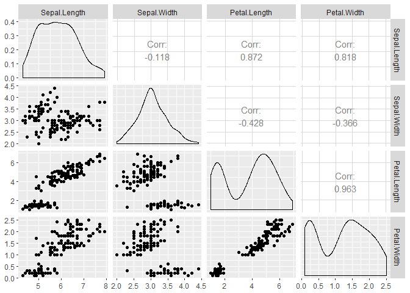
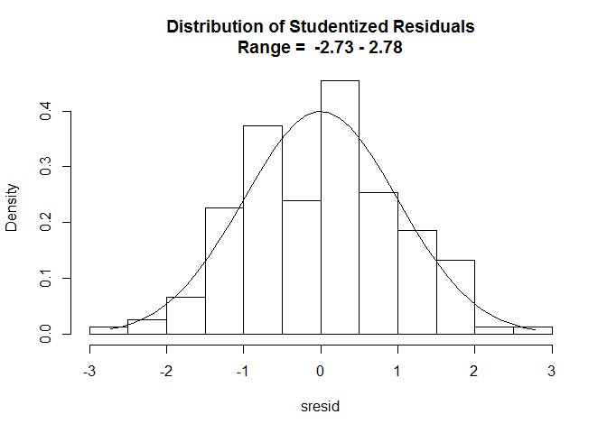
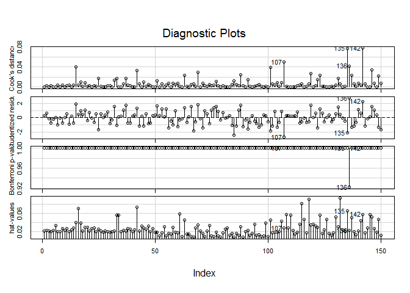
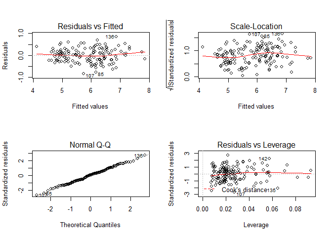
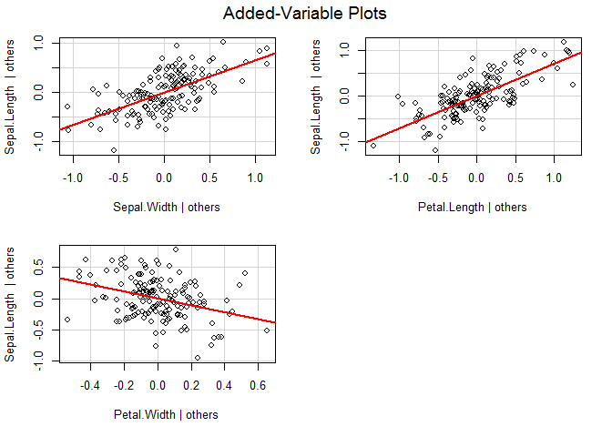

Multivariable Regression Analysis
================
Anthony Contoleon
21 December 2016

The following Multiple linear regression work flow is based on the process demonstrated as a part of Swinburne University of Technology's Advanced Topics in Regression subject in 2016 taught using SPSS and replicated to R.

Data Exploration
----------------

Initial exploration of the data set prior to working with it.

    ##   Sepal.Length    Sepal.Width     Petal.Length    Petal.Width   
    ##  Min.   :4.300   Min.   :2.000   Min.   :1.000   Min.   :0.100  
    ##  1st Qu.:5.100   1st Qu.:2.800   1st Qu.:1.600   1st Qu.:0.300  
    ##  Median :5.800   Median :3.000   Median :4.350   Median :1.300  
    ##  Mean   :5.843   Mean   :3.057   Mean   :3.758   Mean   :1.199  
    ##  3rd Qu.:6.400   3rd Qu.:3.300   3rd Qu.:5.100   3rd Qu.:1.800  
    ##  Max.   :7.900   Max.   :4.400   Max.   :6.900   Max.   :2.500

    ## irisTrim.df 
    ## 
    ##  4  Variables      150  Observations
    ## ---------------------------------------------------------------------------
    ## Sepal.Length 
    ##        n  missing distinct     Info     Mean      Gmd      .05      .10 
    ##      150        0       35    0.998    5.843   0.9462    4.600    4.800 
    ##      .25      .50      .75      .90      .95 
    ##    5.100    5.800    6.400    6.900    7.255 
    ## 
    ## lowest : 4.3 4.4 4.5 4.6 4.7, highest: 7.3 7.4 7.6 7.7 7.9
    ## ---------------------------------------------------------------------------
    ## Sepal.Width 
    ##        n  missing distinct     Info     Mean      Gmd      .05      .10 
    ##      150        0       23    0.992    3.057   0.4872    2.345    2.500 
    ##      .25      .50      .75      .90      .95 
    ##    2.800    3.000    3.300    3.610    3.800 
    ## 
    ## lowest : 2.0 2.2 2.3 2.4 2.5, highest: 3.9 4.0 4.1 4.2 4.4
    ## ---------------------------------------------------------------------------
    ## Petal.Length 
    ##        n  missing distinct     Info     Mean      Gmd      .05      .10 
    ##      150        0       43    0.998    3.758    1.979     1.30     1.40 
    ##      .25      .50      .75      .90      .95 
    ##     1.60     4.35     5.10     5.80     6.10 
    ## 
    ## lowest : 1.0 1.1 1.2 1.3 1.4, highest: 6.3 6.4 6.6 6.7 6.9
    ## ---------------------------------------------------------------------------
    ## Petal.Width 
    ##        n  missing distinct     Info     Mean      Gmd      .05      .10 
    ##      150        0       22     0.99    1.199   0.8676      0.2      0.2 
    ##      .25      .50      .75      .90      .95 
    ##      0.3      1.3      1.8      2.2      2.3 
    ## 
    ## lowest : 0.1 0.2 0.3 0.4 0.5, highest: 2.1 2.2 2.3 2.4 2.5
    ## ---------------------------------------------------------------------------

### Correlation Matrix & Significance

Creating a table of correlations with significance values included.

    ##            row       column        cor            p   n
    ## 1 Sepal.Length  Sepal.Width -0.1175698 1.518981e-01 150
    ## 2 Sepal.Length Petal.Length  0.8717538 0.000000e+00 150
    ## 3  Sepal.Width Petal.Length -0.4284401 4.513307e-08 150
    ## 4 Sepal.Length  Petal.Width  0.8179411 0.000000e+00 150
    ## 5  Sepal.Width  Petal.Width -0.3661259 4.073226e-06 150
    ## 6 Petal.Length  Petal.Width  0.9628654 0.000000e+00 150

### Correlation Matrix Plot

Plotting the correlations between variables in the data with distributions included.



Fitting the Model
-----------------

Fit the multivariable model and returning the coefficients, R squared and adjusted R squared.

``` r
# Basic linear Model
fit <- lm(Sepal.Length~Sepal.Width+Petal.Length+Petal.Width, data = irisTrim.df)

# Multiple R-squared
# Returns unstandardised coefficients
summary(fit)
```

    ## 
    ## Call:
    ## lm(formula = Sepal.Length ~ Sepal.Width + Petal.Length + Petal.Width, 
    ##     data = irisTrim.df)
    ## 
    ## Residuals:
    ##      Min       1Q   Median       3Q      Max 
    ## -0.82816 -0.21989  0.01875  0.19709  0.84570 
    ## 
    ## Coefficients:
    ##              Estimate Std. Error t value Pr(>|t|)    
    ## (Intercept)   1.85600    0.25078   7.401 9.85e-12 ***
    ## Sepal.Width   0.65084    0.06665   9.765  < 2e-16 ***
    ## Petal.Length  0.70913    0.05672  12.502  < 2e-16 ***
    ## Petal.Width  -0.55648    0.12755  -4.363 2.41e-05 ***
    ## ---
    ## Signif. codes:  0 '***' 0.001 '**' 0.01 '*' 0.05 '.' 0.1 ' ' 1
    ## 
    ## Residual standard error: 0.3145 on 146 degrees of freedom
    ## Multiple R-squared:  0.8586, Adjusted R-squared:  0.8557 
    ## F-statistic: 295.5 on 3 and 146 DF,  p-value: < 2.2e-16

### Confidence Intervals for Coefficients

    ##                Estimate Std. Error   t value     Pr(>|t|)      2.5 %
    ## (Intercept)   1.8559975 0.25077711  7.400984 9.853855e-12  1.3603752
    ## Sepal.Width   0.6508372 0.06664739  9.765380 1.199846e-17  0.5191189
    ## Petal.Length  0.7091320 0.05671929 12.502483 7.656980e-25  0.5970350
    ## Petal.Width  -0.5564827 0.12754795 -4.362929 2.412876e-05 -0.8085615
    ##                  97.5 %
    ## (Intercept)   2.3516197
    ## Sepal.Width   0.7825554
    ## Petal.Length  0.8212289
    ## Petal.Width  -0.3044038

### Standardised Parametre Estimates

Contributions by variable values to dimensions.

    ## 
    ## Call:
    ## lm(formula = Sepal.Length ~ Sepal.Width + Petal.Length + Petal.Width, 
    ##     data = irisTrim.df)
    ## 
    ## Standardized Coefficients::
    ##  (Intercept)  Sepal.Width Petal.Length  Petal.Width 
    ##    0.0000000    0.3425789    1.5117505   -0.5122442

Assumption Testing
------------------

### Durbin Watson test

A table of critical values can be found at the following location: [Durbin Watson Critical Values](http://web.stanford.edu/~clint/bench/dw05c.htm). In the following table k = number predictors, K=number coefficients including intercept.

    ##  lag Autocorrelation D-W Statistic p-value
    ##    1     -0.03992126      2.060382   0.808
    ##  Alternative hypothesis: rho != 0

### Partial Correlation Statistics

Contributions by observation to dimensions.

    ##  (Intercept)  Sepal.Width Petal.Length  Petal.Width 
    ##    0.5223182    0.6285707    0.7190656    0.3396174

    ## Analysis of Variance Table
    ## 
    ## Response: Sepal.Length
    ##               Df Sum Sq Mean Sq F value    Pr(>F)    
    ## Sepal.Width    1  1.412   1.412  14.274 0.0002296 ***
    ## Petal.Length   1 84.427  84.427 853.309 < 2.2e-16 ***
    ## Petal.Width    1  1.883   1.883  19.035 2.413e-05 ***
    ## Residuals    146 14.445   0.099                      
    ## ---
    ## Signif. codes:  0 '***' 0.001 '**' 0.01 '*' 0.05 '.' 0.1 ' ' 1

### Multicollinearity

Produce a table of Variance inflation factors and Tolerance figures for assessment. The output changes based on the data. In models where generalized variance-inflation figures are calculated, the VIF figures can be accessed as: `vif(fit)[,1]`. Where it is not, `vif(fit)` is appropriate.

``` r
## Evaluate MultiCollinearity
# variance inflation factors and Tolerance
multi.df <- cbind(vif(fit), 1/vif(fit), sqrt(vif(fit)) > 2, 1/vif(fit) > 0.3)
colnames(multi.df) <- c("VIF", "Tolerance", "VIF > 2", "Tolerance > 0.3")
multi.df
```

    ##                    VIF  Tolerance VIF > 2 Tolerance > 0.3
    ## Sepal.Width   1.270815 0.78689664       0               1
    ## Petal.Length 15.097572 0.06623581       1               0
    ## Petal.Width  14.234335 0.07025267       1               0

### Studentised Residuals

Review the range and distribution of Studentised residuals for the model. The values should fall between -3 and 3 assuming there are no issues with outliers.

### Plot the Distribution of Studentised Residuals



### Mahalanobis Distance

Maximum and minumum Mahalanobis Distance of the model. Values need to be under the critical value: [Mahalanobis Distance Critical Values](https://en.wikiversity.org/wiki/Mahalanobis'_distance)

    ## [1] 0.319473

    ## [1] 13.10109

### Influential Points

Review influential points as per Cook's D, Studentised residuals



### Normality and Linearity

Review residual plots for the assumptions of normality are valid.



### Partial Regression Plots

Partial plots to be reviewed to assess assumptions of linearity.



### Model with Skew and Kurtosis.

    ## 
    ## Call:
    ## lm(formula = Sepal.Length ~ Sepal.Width + Petal.Length + Petal.Width, 
    ##     data = irisTrim.df)
    ## 
    ## Residuals:
    ##      Min       1Q   Median       3Q      Max 
    ## -0.82816 -0.21989  0.01875  0.19709  0.84570 
    ## 
    ## Coefficients:
    ##              Estimate Std. Error t value Pr(>|t|)    
    ## (Intercept)   1.85600    0.25078   7.401 9.85e-12 ***
    ## Sepal.Width   0.65084    0.06665   9.765  < 2e-16 ***
    ## Petal.Length  0.70913    0.05672  12.502  < 2e-16 ***
    ## Petal.Width  -0.55648    0.12755  -4.363 2.41e-05 ***
    ## ---
    ## Signif. codes:  0 '***' 0.001 '**' 0.01 '*' 0.05 '.' 0.1 ' ' 1
    ## 
    ## Residual standard error: 0.3145 on 146 degrees of freedom
    ## Multiple R-squared:  0.8586, Adjusted R-squared:  0.8557 
    ## F-statistic: 295.5 on 3 and 146 DF,  p-value: < 2.2e-16
    ## 
    ## 
    ## ASSESSMENT OF THE LINEAR MODEL ASSUMPTIONS
    ## USING THE GLOBAL TEST ON 4 DEGREES-OF-FREEDOM:
    ## Level of Significance =  0.05 
    ## 
    ## Call:
    ##  gvlma(x = fit) 
    ## 
    ##                       Value p-value                   Decision
    ## Global Stat        7.509044 0.11131    Assumptions acceptable.
    ## Skewness           0.001185 0.97254    Assumptions acceptable.
    ## Kurtosis           0.502432 0.47843    Assumptions acceptable.
    ## Link Function      2.457464 0.11697    Assumptions acceptable.
    ## Heteroscedasticity 4.547962 0.03296 Assumptions NOT satisfied!
